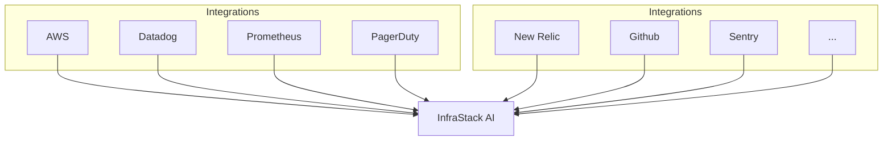

Welcome to InfraStack docs!

## We're working on it! 🚧

{/* <Cards>
  <Card title="Learn more about Next.js" href="https://nextjs.org/docs" />
  <Card title="Learn more about Fumadocs" href="https://fumadocs.vercel.app" />
</Cards> */}
